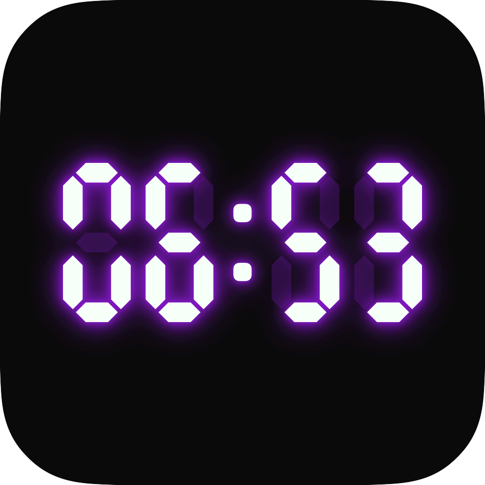

<p align="center">
  
</p>

<h1 align="center">Imperator WidgetClock</h1>

<p align="center">
  A seven-segment retro clock for the macOS desktop. One WidgetKit widget, plus
  a menu bar app that holds its settings.
</p>

The face is drawn from real segment outlines rather than a font, so the unlit
strokes stay visible at 5 percent the way the bars of an LCD clock never go
fully dark. The digits stand upright: most LED clock faces lean, this one does
not.

Five preset colours shared with the rest of the Imperator apps (Imperator Red,
Arcade Green, Neon Blue, Classic White, Electric Purple), a sixth swatch that
opens the system colour wheel, and an optional neon glow ported from the `.neon`
rule in imperator-deals.

Requires macOS 14 or later, Apple silicon. Built and tested on macOS 26 only:
older versions are expected to work but have not been verified.

Install at your own risk. The app is not notarized and carries no Apple
Developer signature, so macOS cannot vouch for it. It is provided as is, with no
warranty, under the MIT license.

## Install

Download the latest zip from
[Releases](https://github.com/goranimperator/imperator-widget-clock/releases),
unzip, and move `Imperator WidgetClock.app` to `/Applications`.

To build it yourself instead:

```bash
make install
```

That builds release, assembles `build/Imperator WidgetClock.app`, signs the
widget extension and then the app, copies it to `/Applications` and launches it.
The `Makefile` is the only build path.

Then place the widget: right-click the desktop, choose Edit Widgets, search for
Imperator WidgetClock, and drag the card out. There is one card, in the medium
size.

Two things worth knowing on first run:

- macOS renders desktop widgets in greyscale unless System Settings, Desktop &
  Dock, Widgets, Widget style is set to Full colour. The widget cannot override
  this. `WidgetRenderingMode` is handed to it, not chosen by it.
- The build is signed with a self-signed certificate and is not notarized, so
  Gatekeeper blocks the first launch of a downloaded copy. Right-click the app
  and choose Open, or run:

```bash
xattr -dr com.apple.quarantine "/Applications/Imperator WidgetClock.app"
```

## Settings

Everything lives in the menu bar popover, and everything applies to the widget:

| Setting | What it does |
|---|---|
| Colour | Five presets, plus a sixth swatch that opens the system colour wheel |
| Neon glow | A near-white core inside three stacked coloured halos |
| Hours | System, 24-hour or 12-hour. System follows the locale |
| Open at Login | Registers a login item through `SMAppService` |

Changing any of them writes the shared settings file and asks WidgetKit for a
fresh timeline, so the widget catches up at once rather than waiting out its
current one. The writes are coalesced: dragging in the colour wheel fires
continuously, and one reload per tick would spend the daily reload budget in a
few seconds.

The popover follows the
[Imperator apps brandbook](https://github.com/goranimperator/imperator-apps-brandbook):
header, divider, content, divider, footer, 340pt wide, forced dark, brand red
instead of the system accent.

## Why the colon does not blink

A WidgetKit widget is a still frame that the system renders in advance and swaps
on a schedule. Its reload budget is measured in dozens of refreshes a day, and
one blink a second would need 86 400.

This was measured rather than assumed. With half-second timeline entries, ten
window captures taken 0.22 seconds apart came back byte-identical, because macOS
collapses anything finer than a minute. So the colon stays lit, the widget takes
one timeline entry per minute, and there is no pulse and no blink anywhere in
the code.

An earlier version drew a second clock straight onto the desktop, in a
borderless panel that did blink and pulse. It was removed: the clock is a widget
and nothing else.

## How it is built

There is no Xcode on the machine this was written on, only the Command Line
Tools, so there is no `.xcodeproj` and no `xcodebuild`. It is SwiftPM plus
Makefile bundle assembly, the same shape as the other Imperator apps. Four
targets:

- **`ClockCore`** is the whole face: segment geometry, the lit and unlit paths,
  the colour and glow rules, and the app/widget settings contract.
- **`ImperatorClock`** is the menu bar app. A status item and a settings
  popover, nothing more. Two separate things keep it off the Dock and out of the
  app switcher, and it needs both: `LSUIElement` in `Info.plist`, because
  LaunchServices decides on the Dock tile before the process runs, and
  `setActivationPolicy(.accessory)` for the switcher and for the popover to
  behave as an accessory window. The menu bar icon is drawn rather than taken
  from SF Symbols, and its outline is the gamepad body from imperator-free-games
  so the two apps are the same size side by side.
- **`ClockWidget`** is the widget extension. One widget, medium family only, one
  timeline entry per minute, 90 entries per request.
- **`ClockPreview`** is a headless renderer that produces the review PNGs and
  the pixel measurements behind the gates. It never ships. It does not draw the
  app icon: that is supplied artwork, and the renderer that used to generate it
  wrote over the file by default.

```bash
make run       # build and launch from build/ without installing
make preview   # render the face to build/preview and open it
make gates     # run every acceptance check in GATES.md
make clean
```

Assembling an appex by hand has two traps, both of which make the widget
register with `pluginkit` and then render nothing, which looks exactly like a
widget that was never installed:

1. Every shipping macOS widget binary references `_NSExtensionMain`. A SwiftPM
   executable does not, so WidgetKit's `@main` falls into ExtensionFoundation,
   fails to recognise the extension type, and the process exits before it can
   answer `getAllDescriptors`. `Package.swift` links the widget with
   `-e _NSExtensionMain` for this reason.
2. `containermanagerd` rejects an App Group whose identifier is not prefixed
   with the signing team ID, and a self-signed build has no team. The rejection
   is fatal, so the extension died at sandbox init after 44 ms.

## Where the settings live

Not in an App Group, for the reason above. The file sits inside the widget
extension's own sandbox container:

```
~/Library/Containers/com.goranimperator.ImperatorClock.ClockWidget/Data/Library/Application Support/ImperatorClock/settings.json
```

An extension may always read its own container, and the menu bar app is not
sandboxed, so it writes there by absolute path. Same file, both sides, no
entitlement involved. That file is the whole of the app's state.

The widget also writes a heartbeat next to it every time WidgetKit asks it for a
timeline. It is the only evidence from outside that the extension really ran and
what it read, and the acceptance check for the shared store reads it.

## Gates

`GATES.md` is the acceptance ledger: one observable outcome per gate, each with
the command that decides it. `make gates` runs every runnable one. Three of them
need the app installed, and one of those three also needs the widget to be
placed on the desktop.

Registration is not accepted as proof of life. The extension was registered for
hours at one point while exiting after 44 ms, so the live check reads the
heartbeat and checks chronod's own verdict on the descriptor query:

```bash
node scripts/check-widget-live.mjs
```

When the widget looks dead, read the real logs. `log` is a zsh builtin that
shadows the tool, so call it by path:

```bash
/usr/bin/log show --last 5m --info --debug --predicate 'process == "chronod"' --style compact
```

`getAllDescriptors result.` means the extension answered. `error result` means
it died first.

## Release

Follow the `imperator-release` skill. Audit first, tag last, and never without
an explicit instruction.

```bash
make dist VERSION=x.y.z
make release VERSION=x.y.z NOTES="What this release changes."
```

`NOTES` is what the GitHub release page says. Leave it out and it falls back to
a description of the app, which only reads correctly on a first release. The
Gatekeeper instructions are appended either way.

`dist` is safe and touches nothing in git or on the remote. `release` bumps both
`Info.plist` files, commits, tags, pushes and publishes a GitHub release with
the zip attached. Both plists have to move together: the appex version is what
chronod caches a widget's descriptors against, so a version that never changes
means a reinstall keeps the old configuration.

Signing uses the self-signed `Imperator Dev` identity rather than ad-hoc. The
login item registration is keyed to the bundle's designated requirement, and
WidgetKit caches the extension by its signing identity, so an ad-hoc cdhash that
changes on every build would drop the widget out of the gallery after an update.

## Licence

MIT.
